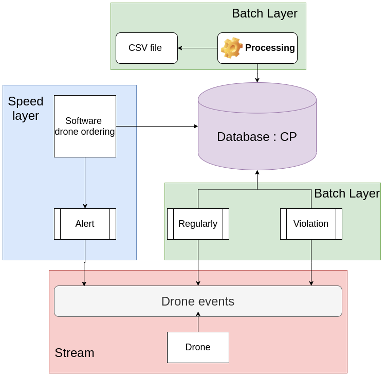

# PrestaCop
PrestaCop, a company specializing in service delivery for police forces, wants to create a drone service to help police systems make parking tickets. A camera with a pattern recognition software identifies license plates and characterizes infractions.

## Components of the application
```
PrestaCop
├── Analytics
├── Consumer
├── HDFS
└── Producer
```


## Application architecture

